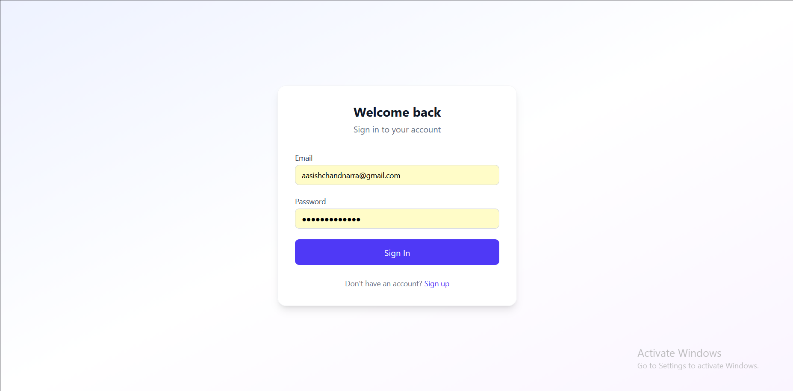
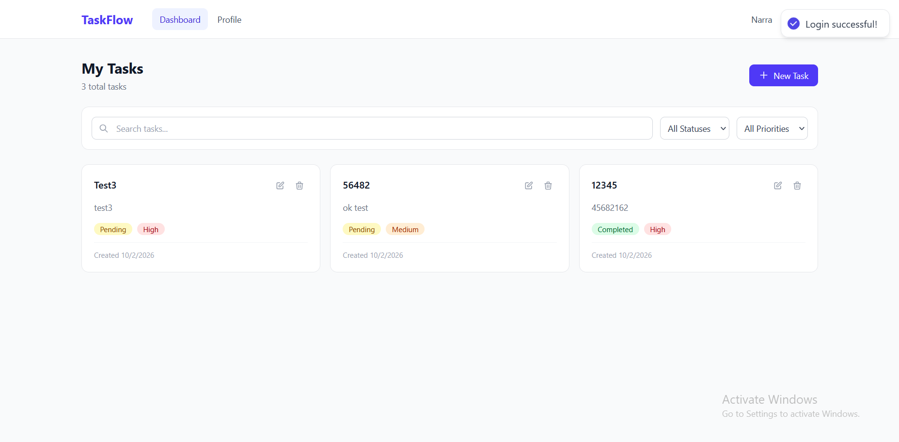
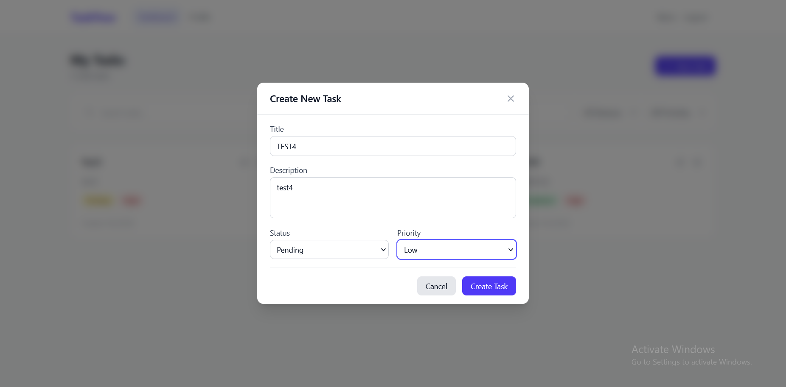

# TaskFlow — Full-Stack Task Management Application

TaskFlow is a production-ready, full-stack task management web application that provides secure user authentication, efficient task CRUD operations, and a responsive task dashboard — all built with modern web technologies and best practices.

---

## Features

- Secure JWT-based authentication (access + refresh tokens)
- Full CRUD for user tasks
- Task filtering (status, priority, search)
- Pagination & sorting support
- Clean, responsive UI with Tailwind CSS
- Role-based access & protected frontend routes
- Strong backend validation, rate limiting & logging
- Designed to be deployed in production

> Built with separation of concerns between frontend and backend — ideal for scalable development.

---

## Tech Stack

### Frontend

| Technology | Purpose |
|-----------|---------|
| Next.js 16 | App Router, TypeScript, Server & Client Components |
| React 19 | UI rendering |
| Tailwind CSS v4 | Utility-first responsive styling |
| TanStack React Query | Server state caching & synchronization |
| Axios | HTTP client with interceptors for auto token refresh |
| Zod + React Hook Form | Type-safe form validation |
| react-hot-toast | Toast notifications |

### Backend

| Technology | Purpose |
|-----------|---------|
| Node.js + Express 5 | REST API server (TypeScript) |
| PostgreSQL + Prisma ORM | Relational database with type-safe queries |
| JWT (JSON Web Tokens) | Stateless authentication |
| bcrypt | Password hashing (10 salt rounds) |
| helmet + cors + rate limiting | Security middleware |
| Winston | Structured logging with file rotation |

> Comprehensive full-stack architecture with clean API design.

---

## Screenshots

### Login Page
The login page features a clean, centered form with email and password fields. Includes client-side validation powered by Zod, error messages for invalid input, and a link to the registration page.



### Registration Page
New users can create an account by providing their name, email, and a strong password. Password requirements (uppercase, number, special character) are validated in real-time with clear error feedback.


### Dashboard — Task List
The main dashboard displays all user tasks in a responsive card grid. Each card shows the task title, description, status badge (Pending/In Progress/Completed), and priority badge (Low/Medium/High). Includes a "New Task" button and total task count.



### Task Filters & Search
The filter bar allows users to narrow down tasks by status, priority, or free-text search. Search is debounced (300ms) for smooth performance. Filters update the task list instantly via React Query.


### Create / Edit Task Modal
A modal dialog for creating new tasks or editing existing ones. Fields include title, description, status dropdown, and priority dropdown — all validated with Zod before submission.



### Delete Confirmation
Before deleting a task, users see a confirmation dialog to prevent accidental deletion. The delete operation uses optimistic updates for a snappy user experience.


### User Profile
The profile page shows the user's avatar initial, name, email, and join date. Users can update their name and email inline with validation and toast feedback.


### Health Check API
The backend exposes a `/api/health` endpoint that returns server status, uptime, and timestamp — useful for monitoring and deployment health checks.


---

## Prerequisites

Make sure your development machine has:

- **Node.js** v18+
- **npm** v9+
- **PostgreSQL** v14+ (local or cloud)

---

## Setup Instructions

### 1. Database Setup

**Local Option**
```bash
psql -U postgres -c "CREATE DATABASE taskapp;"
```

**Cloud Option**
Use services like Supabase, Neon, Railway, etc., and get your connection string.

### 2. Backend Setup
```bash
cd backend
npm install
cp .env.example .env
# Fill in DATABASE_URL & JWT secrets

npx prisma migrate dev --name init

npm run dev
```

The backend API server will run at **http://localhost:5000**.

### 3. Frontend Setup
```bash
cd frontend
npm install
cp .env.local.example .env.local
# Set NEXT_PUBLIC_API_URL=http://localhost:5000

npm run dev
```

The frontend will run at **http://localhost:3000**.

---

## Environment Variables

### Backend (`backend/.env`)
```env
PORT=5000
NODE_ENV=development
DATABASE_URL="your_postgres_connection_string"
JWT_ACCESS_SECRET="your_secret_here"
JWT_REFRESH_SECRET="your_secret_here"
CLIENT_URL=http://localhost:3000
```

### Frontend (`frontend/.env.local`)
```env
NEXT_PUBLIC_API_URL=http://localhost:5000
```

> These are required for secure authentication and API calls.

---

## API Documentation

### Authentication

| Method | Endpoint | Description |
|--------|----------|-------------|
| POST | `/api/auth/register` | Register a new user |
| POST | `/api/auth/login` | Authenticate a user |
| POST | `/api/auth/refresh` | Refresh tokens |
| POST | `/api/auth/logout` | Logout user |

### User

| Method | Endpoint | Description |
|--------|----------|-------------|
| GET | `/api/user/profile` | Get current user (protected) |
| PUT | `/api/user/profile` | Update user profile (protected) |

### Tasks

| Method | Endpoint | Description |
|--------|----------|-------------|
| POST | `/api/tasks` | Create task (protected) |
| GET | `/api/tasks` | List tasks (protected) |
| GET | `/api/tasks/:id` | Get single task (protected) |
| PUT | `/api/tasks/:id` | Update task (protected) |
| DELETE | `/api/tasks/:id` | Delete task (protected) |

**Query Parameters:** Supports filtering (`status`, `priority`), `search`, `page`, `limit`, and `sort` (e.g., `-createdAt` for newest first).

---

## Project Structure

```
backend/
├── prisma/schema.prisma        # Database schema & migrations
├── src/
│   ├── config/                 # Database & environment config
│   ├── controllers/            # Route handler logic
│   ├── middleware/              # Auth, error handling, validation
│   ├── routes/                 # API route definitions
│   ├── utils/                  # JWT, logger, async handler
│   ├── types/                  # TypeScript declarations
│   ├── app.ts                  # Express app setup
│   └── server.ts               # Entry point

frontend/
├── src/
│   ├── app/                    # Next.js pages (App Router)
│   │   ├── (auth)/             # Login & Register pages
│   │   └── (dashboard)/        # Dashboard & Profile pages
│   ├── components/             # React components
│   │   ├── auth/               # Auth forms & guards
│   │   ├── dashboard/          # Task CRUD components
│   │   ├── layout/             # Navbar
│   │   └── ui/                 # Button, Input, Modal
│   ├── hooks/                  # Custom React hooks
│   ├── lib/                    # API client, auth helpers, query client
│   ├── types/                  # TypeScript interfaces
│   └── utils/                  # Validation schemas, constants
```

> Modular organization for scalability and maintainability.

---

## Production Deployment

### Backend
Deploy on:
- **Railway**
- **Render**
- **AWS EC2 / ECS**

Set `NODE_ENV=production` for security headers and optimized logging.

### Frontend
Deploy on:
- **Vercel** (recommended for Next.js)
- **Netlify**

Use HTTPS & secure environment configs.

---

## Security Checklist

- [x] Strong random JWT secrets
- [x] Proper CORS origins
- [x] Backend rate limiting
- [x] Input validation (client + server)
- [x] Password hashing with bcrypt
- [ ] Use HTTPS in production
- [ ] Connection pooling for PostgreSQL

---

## About

TaskFlow is a modern, secure, and scalable task management system that follows clean architecture and professional engineering practices — perfect for learning full-stack development or deploying a real product.

---

## License

This project does not currently list a license. You may want to add one (e.g., MIT) if you intend open source distribution.
