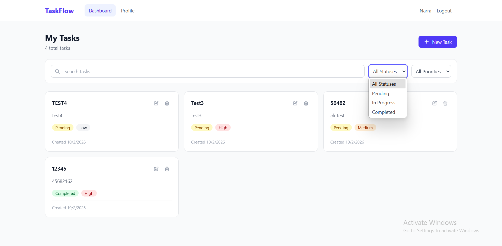
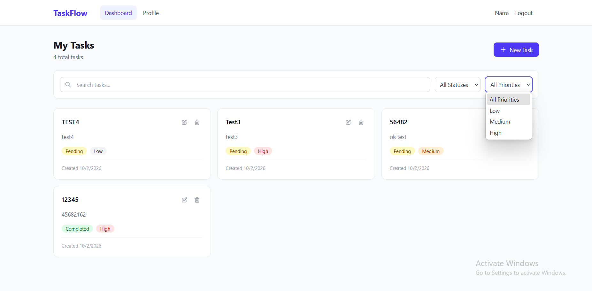
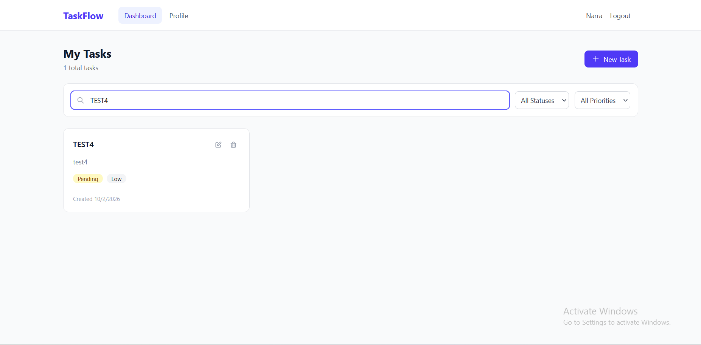

# TaskFlow — Full-Stack Task Management Application

TaskFlow is a production-ready, full-stack task management web application that provides secure user authentication, efficient task CRUD operations, and a responsive task dashboard — all built with modern web technologies and best practices.

---

## Features

- Secure JWT-based authentication (access + refresh tokens)
- Full CRUD for user tasks
- Task filtering (status, priority, search)
- Pagination & sorting support
- Clean, responsive UI with Tailwind CSS
- Role-based access & protected frontend routes
- Strong backend validation, rate limiting & logging
- Designed to be deployed in production

> Built with separation of concerns between frontend and backend — ideal for scalable development.

---

## Tech Stack

### Frontend

| Technology | Purpose |
|-----------|---------|
| Next.js 16 | App Router, TypeScript, Server & Client Components |
| React 19 | UI rendering |
| Tailwind CSS v4 | Utility-first responsive styling |
| TanStack React Query | Server state caching & synchronization |
| Axios | HTTP client with interceptors for auto token refresh |
| Zod + React Hook Form | Type-safe form validation |
| react-hot-toast | Toast notifications |

### Backend

| Technology | Purpose |
|-----------|---------|
| Node.js + Express 5 | REST API server (TypeScript) |
| PostgreSQL + Prisma ORM | Relational database with type-safe queries |
| JWT (JSON Web Tokens) | Stateless authentication |
| bcrypt | Password hashing (10 salt rounds) |
| helmet + cors + rate limiting | Security middleware |
| Winston | Structured logging with file rotation |

> Comprehensive full-stack architecture with clean API design.

---

## Screenshots

### Login Page

The login page provides a clean, centered authentication form with email and password fields. It features client-side validation powered by Zod, clear error messages for invalid input, and a "Sign up" link for new users. The page uses a subtle gradient background for a modern, professional look.


---

### Dashboard — Task Overview

After logging in, users land on the main dashboard showing all their tasks in a responsive card grid. Each task card displays the title, description, color-coded status badge (Pending, In Progress, Completed), and priority badge (Low, Medium, High). A "Login successful!" toast notification confirms the user's authentication. The top bar shows the TaskFlow logo, navigation links, and the user's name.


---

### Create New Task

Clicking the "+ New Task" button opens a modal dialog for creating tasks. The form includes fields for title, description (optional), a status dropdown (Pending / In Progress / Completed), and a priority dropdown (Low / Medium / High). All fields are validated with Zod before submission. The background dims with a blur overlay to keep focus on the form.


---

### Dashboard — After Adding Tasks

The dashboard updates instantly after creating a new task, thanks to React Query's cache invalidation. Tasks are displayed in a 3-column responsive grid with the newest tasks appearing first. Each card has edit and delete action icons in the top-right corner. The total task count updates in the header.


---

### Filter by Status

The status filter dropdown allows users to quickly filter tasks by their current state — All Statuses, Pending, In Progress, or Completed. Selecting a filter instantly updates the task list without a full page reload, powered by React Query's refetching mechanism.



---

### Filter by Priority

Similarly, the priority filter lets users view tasks by importance level — All Priorities, Low, Medium, or High. Filters can be combined with the status filter and search bar for precise task discovery. All filtering happens server-side for optimal performance.



---

### Search Tasks

The search bar provides real-time, debounced search (300ms delay) across task titles and descriptions. As the user types, results are filtered instantly — here searching "TEST4" shows only the matching task. The search is case-insensitive and works alongside the status and priority filters.



---

### User Profile

The profile page displays the user's avatar initial (derived from their name), full name, email address, and membership date. Users can edit their name and email through inline form fields with a "Save Changes" button. The active "Profile" tab is highlighted in the navigation bar.


---

## Prerequisites

Make sure your development machine has:

- **Node.js** v18+
- **npm** v9+
- **PostgreSQL** v14+ (local or cloud)

---

## Setup Instructions

### 1. Database Setup

**Local Option**
```bash
psql -U postgres -c "CREATE DATABASE taskapp;"
```

**Cloud Option**
Use services like Supabase, Neon, Railway, etc., and get your connection string.

### 2. Backend Setup
```bash
cd backend
npm install
cp .env.example .env
# Fill in DATABASE_URL & JWT secrets

npx prisma migrate dev --name init

npm run dev
```

The backend API server will run at **http://localhost:5000**.

### 3. Frontend Setup
```bash
cd frontend
npm install
cp .env.local.example .env.local
# Set NEXT_PUBLIC_API_URL=http://localhost:5000

npm run dev
```

The frontend will run at **http://localhost:3000**.

---

## Environment Variables

### Backend (`backend/.env`)
```env
PORT=5000
NODE_ENV=development
DATABASE_URL="your_postgres_connection_string"
JWT_ACCESS_SECRET="your_secret_here"
JWT_REFRESH_SECRET="your_secret_here"
CLIENT_URL=http://localhost:3000
```

### Frontend (`frontend/.env.local`)
```env
NEXT_PUBLIC_API_URL=http://localhost:5000
```

> These are required for secure authentication and API calls.

---

## API Documentation

### Authentication

| Method | Endpoint | Description |
|--------|----------|-------------|
| POST | `/api/auth/register` | Register a new user |
| POST | `/api/auth/login` | Authenticate a user |
| POST | `/api/auth/refresh` | Refresh tokens |
| POST | `/api/auth/logout` | Logout user |

### User

| Method | Endpoint | Description |
|--------|----------|-------------|
| GET | `/api/user/profile` | Get current user (protected) |
| PUT | `/api/user/profile` | Update user profile (protected) |

### Tasks

| Method | Endpoint | Description |
|--------|----------|-------------|
| POST | `/api/tasks` | Create task (protected) |
| GET | `/api/tasks` | List tasks (protected) |
| GET | `/api/tasks/:id` | Get single task (protected) |
| PUT | `/api/tasks/:id` | Update task (protected) |
| DELETE | `/api/tasks/:id` | Delete task (protected) |

**Query Parameters:** Supports filtering (`status`, `priority`), `search`, `page`, `limit`, and `sort` (e.g., `-createdAt` for newest first).

---

## Project Structure

```
backend/
├── prisma/schema.prisma        # Database schema & migrations
├── src/
│   ├── config/                 # Database & environment config
│   ├── controllers/            # Route handler logic
│   ├── middleware/              # Auth, error handling, validation
│   ├── routes/                 # API route definitions
│   ├── utils/                  # JWT, logger, async handler
│   ├── types/                  # TypeScript declarations
│   ├── app.ts                  # Express app setup
│   └── server.ts               # Entry point

frontend/
├── src/
│   ├── app/                    # Next.js pages (App Router)
│   │   ├── (auth)/             # Login & Register pages
│   │   └── (dashboard)/        # Dashboard & Profile pages
│   ├── components/             # React components
│   │   ├── auth/               # Auth forms & guards
│   │   ├── dashboard/          # Task CRUD components
│   │   ├── layout/             # Navbar
│   │   └── ui/                 # Button, Input, Modal
│   ├── hooks/                  # Custom React hooks
│   ├── lib/                    # API client, auth helpers, query client
│   ├── types/                  # TypeScript interfaces
│   └── utils/                  # Validation schemas, constants
```

> Modular organization for scalability and maintainability.

---

## Production Deployment

### Backend
Deploy on:
- **Railway**
- **Render**
- **AWS EC2 / ECS**

Set `NODE_ENV=production` for security headers and optimized logging.

### Frontend
Deploy on:
- **Vercel** (recommended for Next.js)
- **Netlify**

Use HTTPS & secure environment configs.

---

## Security Checklist

- [x] Strong random JWT secrets
- [x] Proper CORS origins
- [x] Backend rate limiting
- [x] Input validation (client + server)
- [x] Password hashing with bcrypt
- [ ] Use HTTPS in production
- [ ] Connection pooling for PostgreSQL

---

## About

TaskFlow is a modern, secure, and scalable task management system that follows clean architecture and professional engineering practices — perfect for learning full-stack development or deploying a real product.

---

## License

This project does not currently list a license. You may want to add one (e.g., MIT) if you intend open source distribution.
